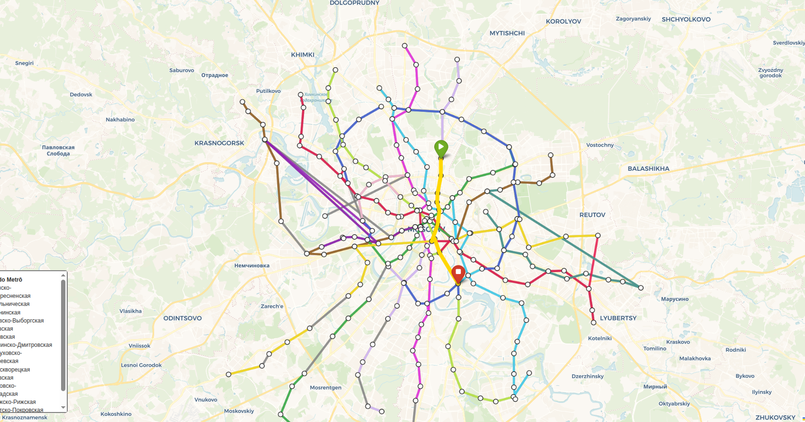
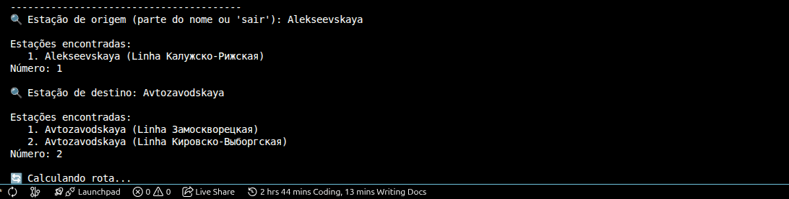
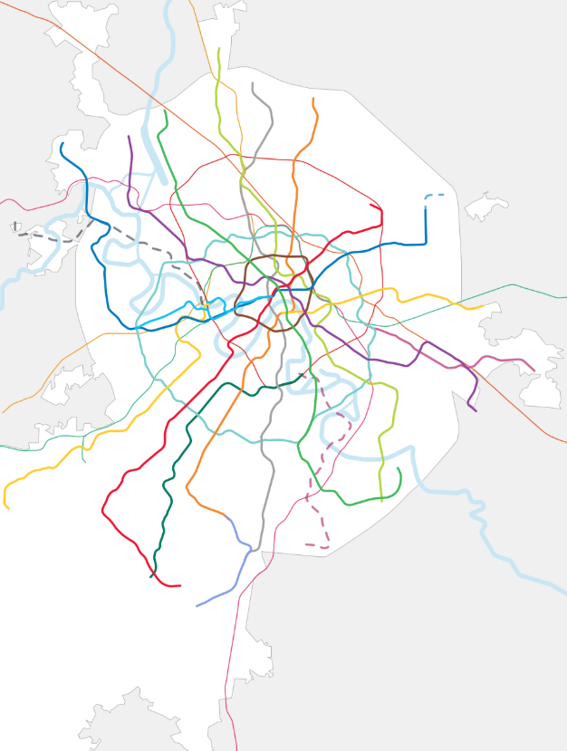

# G25_Grafos_PA-26.1

**Número do trabalho:** 1  
**Conteúdo do Módulo: Grafos**

## Alunos

| Matrícula |          Nome Completo           |
| :-------: | :------------------------------: |
| 211062929 | Davi dos Santos Brito Nobre      |
| 221008202 | José Eduardo Vieira do Prado     |

## Sobre o trabalho

Este projeto implementa o algoritmo de **Dijkstra** para encontrar a rota mais rápida entre duas estações do metrô de Moscou. O sistema modela a rede metroviária como um grafo não direcionado e ponderado, onde os vértices representam as estações e as arestas representam os trechos entre estações consecutivas ou conexões de baldeação. Os pesos das arestas são estimados a partir de distâncias geográficas reais e parâmetros operacionais do metrô. O metrô da Rússia foi pensado em se aprimorar nos anos 50 muito após a segunda guerra com uma união soviética forte. Os soviéticos criaram então uma linha pensada em tornar carros incovenientes e o transporte público mais acessível. Mesmo com um número menor de expansões recentes, o metrô de Moscou ainda é o terceiro maior do mundo com 450km de extensão, perdendo somente para o de Nova Iorque e o de Xangai. Os luxuosos metrôs soviéticos com arquitetura em mármore lustroso ainda são considerados o palácio do povo, cumprindo sua missão de ser os metrôs mais profundos (por conta da guerra fria) e mais rápidos do mundo. Este trabalho busca ver se estes 450km realmente tem rotas tão rápidas.

### 🧩 Desafios e soluções de engenharia

A construção de um grafo realista e funcional exigiu a superação de diversas dificuldades técnicas, que foram resolvidas com uma abordagem de engenharia de dados:

1. **Obtenção da topologia da rede**  
   - **Fonte inicial:** Pacote npm [`metrostations`](https://www.npmjs.com/package/metrostations), que fornece um arquivo JSON com a lista de estações e as conexões de baldeação.  
   - **Criando o CSV**: Precisando ler os dados para criação do Dijkstra e a formatação de toda uma rede de informações, utilizamos um código feito por LLM (import json.py, agora totalmente inutil mas mantido também para fins de backtracking)para gerar a base metro_moscou.csv. 
   - **Limitação:** Os IDs originais do JSON não seguiam uma ordem sequencial simples e não incluíam coordenadas geográficas ou a ordem das estações ao longo das linhas.

2. **Inclusão de coordenadas e ordenação das linhas**  
   - **Fonte complementar:** Dataset público [`nalgeon/metro`](https://github.com/nalgeon/metro), que contém latitude, longitude e a posição ordinal de cada estação dentro de sua linha.  
   - **Desafio de correspondência:** Os dois datasets utilizam sistemas de identificação diferentes. A solução foi realizar uma correspondência exata pelos nomes originais em russo, normalizados do cirilico pro alfabeto latino para evitar espaços extras e variações de grafia que conseguimos com metro_moscou.csv.

3. **Geração das arestas consecutivas**  
   - Como o arquivo do `metrostations` não indica a sequência das estações, utilizamos a ordem fornecida pelo `nalgeon/metro` para criar arestas entre estações vizinhas da mesma linha. Para as linhas em que essa correspondência falhou, recorremos à ordem natural (e logica) em que as estações aparecem no CSV original, garantindo a conectividade total da rede.

4. **Estimativa dos tempos de viagem (pesos das arestas)**  
   - **Problema:** Dados oficiais de tempo de percurso entre cada par de estações não estão publicamente disponíveis de forma consolidada, poucos se interessaram em manter esta base e o unico local disponível o software nacional russo Yandex só os tem por obter diretamente da fonte.  
   - **Solução de engenharia:**  
     - Cálculo da distância em linha reta entre as coordenadas geográficas das estações usando a **fórmula de Haversine**.  
     - Aplicação de parâmetros operacionais reais obtidos de estudos do metrô de Moscou: **velocidade média de 41,62 km/h** (conseguido a partir do modelo do trem e sua velocidade corrida média no wikipédia) e **tempo médio de parada de 60 segundos** (tempo totalmente arbitrário que é uma média dos trens parados em capitais brasileiras) por estação.  
     - Tempo total da aresta = (distância / velocidade) + tempo de parada.  
   - **Fallback:** Para estações sem coordenadas válidas, utiliza-se uma distância média de 1,81 km (calculada a partir da extensão total da rede dividida pelo número de estações), garantindo que o algoritmo de Dijkstra sempre tenha pesos razoáveis.

5. **Tratamento de coordenadas inválidas ou ausentes**  
   - Algumas estações não possuíam coordenadas no dataset `nalgeon/metro` ou apresentavam valores fora da região de Moscou.  
   - **Estratégia:**  
     - Busca adicional na API do **OpenStreetMap (Nominatim)** usando o nome original em russo.  
     - Para as estações que mesmo assim não retornaram coordenadas confiáveis, optou-se por **não utilizar um fallback geográfico** (como o centro de Moscou), evitando distorções visuais no mapa, confiando 100% nos id's de rota (as rotas que isso ocorreu estão com partes cinza no mapa, se provando funcionais).  
     - No mapa, as linhas são desenhadas apenas entre estações com coordenadas válidas consecutivas, mantendo a continuidade visual mesmo quando há estações intermediárias sem geolocalização.

6. **Busca flexível de estações**  
   - O sistema permite buscar estações digitando parte do nome em **português transliterado**, **russo original** ou **transliteração ASCII**, graças a um índice que armazena as três variações de cada estação.

### 🗺️ Visualização do mapa

O mapa interativo é gerado com a biblioteca **Folium** (Leaflet para Python). As linhas do metrô são coloridas de acordo com a linha oficial e desenhadas como segmentos retos conectando as coordenadas das estações. Para evitar conflitos visuais com os trilhos desenhados no mapa base, utiliza-se o estilo cartográfico limpo **CartoDB Voyager**, que omite a infraestrutura de transporte, destacando apenas as conexões modeladas pelo grafo. A rota calculada é exibida em amarelo espesso, com marcadores especiais para origem e destino.

## Linguagem utilizada

- **Python 3** (versão 3.12+)
- Bibliotecas:
  - `csv`, `json`, `math`, `heapq`, `collections`, `urllib.request`, `time` (módulos da biblioteca padrão)
  - `requests` – para chamadas à API Nominatim
  - `folium` – para geração do mapa interativo

## Screenshots (demonstração) 

  <table>
    <tr>
      <td align="center"> Tela inicial</td>
      <td align="center"> Busca de estação</td>
      <td align="center"> Rota de 2020</td>
    </tr>
  </table>

## Vídeo (demonstração)